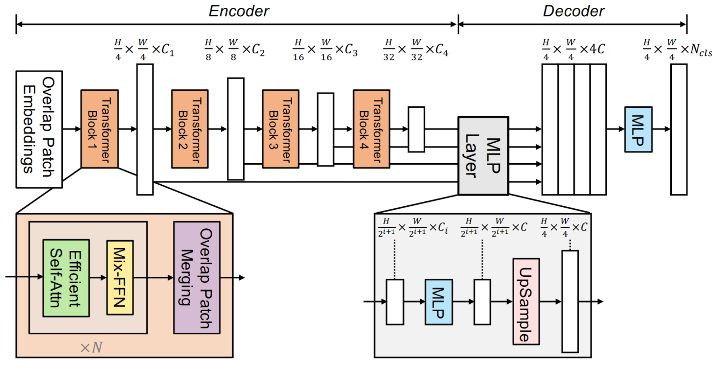
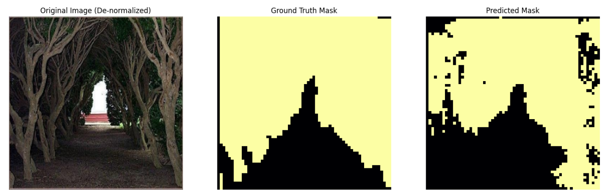
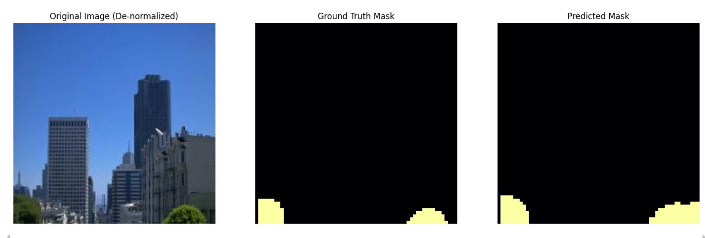
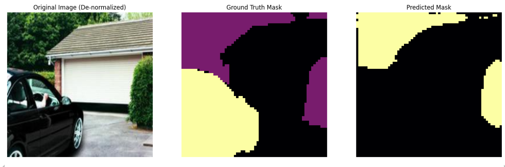

SegFormer is a simple architecture with some key innovations that allow it to acheive state of the art performance at much higher speeds and fewer parameters than other competing methods. Here we will implement the building blocks of SegFormer. An overview of the architecture is provided below.

## Paper Link: 
https://arxiv.org/pdf/2105.15203.pdf

## Architecture of SegFormer

## Data
For this assignment, we will use a simplified subset of ADE20K containg approximately 11,000 images with only four classes: "plant", "person/animal", "vehicle", and "background". The data in composed of a semantic class for each pixel - there is no distinction between different instances of the same object, unlike in previous assignments.

## Modules
As illustrated in the **Figure 2** and **Section 3** in the paper, we divide SegFormer into encoder-decoder sections. The encoder mainly consists of multiple layers of MixTransformerEncoderLayer, which then consists of OverlapPatchMergiing + (EfficientSelfAttention + MixFFN). While patch merging is relatively intuitive, you have to implement EfficientSelfAttention following **Equation 1** in the paper, and MixFFN as illustrated in **Equation 3**. On the other hand, the decoder section also consists of multiple decoder blocks, ending with a MLP. Refer to **Equation 4** for this part.

## Output

## Future Work

We didn't perform data augmentation. Data augmentation is beneficial as it performs transformations, scaling and various other augmentations to enhance the diversity of the training set. Since we didn't perform it, the model might not learn those variations that can happen in the real world.

Additionally, we didn't try different optimization techniques when talking specifically about the training process. Using advanced optimization techniques could be effective in convergence to minimizing loss.